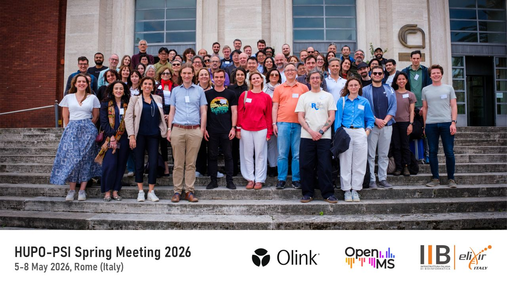
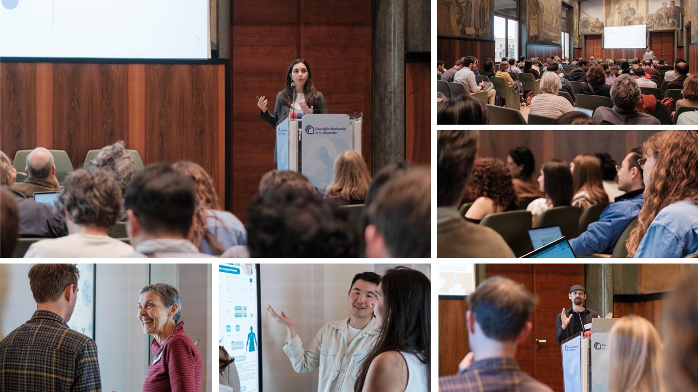

## Introduction

The HUPO-PSI [@Deutsch2023] AI-readiness Working Group joined the most recent Spring Meeting in Rome, where the full week was devoted to the many facets of AI in proteomics. AI is no longer an isolated corner of the conference program but has become one of the most prominent and fastest-evolving parts of our field, shaping how we process spectra, extract metadata, benchmark tools, and arrive at diagnostic conclusions. The Spring Meeting was an opportunity for the Working Group to decide how best to support and guide responsible AI development within this landscape.

:::{.column-body-outset}

:::

## A recap of the PSI-AI sessions

### Hands-on training in reprocessing public proteomics data

The week opened with the **Education Day**, a new format aimed at introducing PSI standards to newer members. The AI-readiness Working Group used the day for two things: a morning session on the core concepts of reprocessing public proteomics data, including the standards and analytical hurdles involved, followed by an afternoon of hands-on technical and biological tutorials that translated the conceptual material into actionable code. The materials will be shared openly and reused at the HUPO pre-congress workshop, which means the audience for this work extends well beyond the people who happened to be in the room.

::: {.callout-note icon=false title="Hands-on tutorials"}

Try out the hands-on tutorials from the Education Day and learn how PSI standards can be used in AI workflows for peptide property prediction:

1. [From search results to a spectral library (mzSpecLib, mzPAF, ProForma, and PSI-MOD)](https://www.kaggle.com/code/ralfga/psi-workshop-part-1-search-results-to-mzspeclib)
2. [Retention time prediction (mzSpecLib, ProForma)](https://www.kaggle.com/code/ralfga/psi-workshop-part-2-retention-time-prediction/)
3. [Fragment intensity prediction with a BiLSTM (mzSpecLib, mzPAF, USI, and PROXI)](https://www.kaggle.com/code/ralfga/psi-workshop-part-3-ms2-intensity-prediction/)

:::

### AI as a new layer on existing PSI standards

The meeting itself opened with a **joint coordinating session**, and the value of that format became clear almost immediately. AI is now present across the entire experimental workflow, which means the Working Group needs to engage closely with the other PSI Working Groups and treat AI as a new layer on top of existing standards rather than a parallel track. That principle keeps the work moving faster and preserves interoperability.

### Adapting AnnData for proteomics with PSI-AI and scverse

Nowhere was this more visible than in the **quantification format** discussion. The proposal builds on **AnnData** [@Virshup2024], the format the scverse community developed for single-cell omics, and adapts it for proteomics quantification. The division of labor is deliberate: PSI-AI defines the ontology and validation rules, while scverse contributes the underlying implementation. Feedback in the room was positive, particularly on the use of controlled vocabularies and on linking SDRF with AnnData so that provenance travels with the data, going beyond raw measurements to capture the statistical and biological transformations and conclusions drawn from them. LinkML emerged as a candidate for handling the unstructured section of AnnData, and the next steps focus on defining the specification, the validator, and reference implementations.

### mzPeak is a faster alternative to mzML for upstream data access

If quantification was about giving downstream analysis a stable home, the **mzPeak** [@VanDenBossche2025] session was about making upstream access faster. This effort, a core focus of the PSI-MS group, already shows substantial speed improvements over mzML, and implementations are appearing across multiple programming languages. The next step is to formalize the standard, and vendor engagement will be actively pursued, since input from instrument manufacturers will be essential to ensure widespread adoption.

### Automated metadata extraction from raw files and publications

Standards are only as useful as the metadata that travels with them, which is why the **SDRF** [@Dai2021] session drew so much attention. **HAMLET**, an agentic pipeline that extracts structured metadata directly from raw files and accompanying publications, was introduced as a way to close the gap between the data that exists in public repositories and the metadata that should accompany it. The framework is tunable through prompts and ontologies, but the design choice that matters most is the emphasis on normalization rather than on the LLM itself. An essential point going forward will be a clear separation between human-annotated and AI-generated metadata files, so that downstream users always know which is which.

### Toward a practical checklist for AI in proteomics

That naturally led into the benchmarking and **MIAPE-AI** session, where **ProteoBench** [@Devreese2025] and the **ProteomicsML** [@Rehfeldt2023] index of existing methods and workflows set the stage. The group identified the AI tasks that currently appear most often in proteomics and began outlining MIAPE-AI, starting from the DOME guidelines. The ambition is pragmatic: a checklist that developers and reviewers can both use, with topic-specific flavors much like SDRF has spawned for different experimental designs. Retention time prediction, de novo sequencing, and biomarker discovery each deserve their own profile, and existing MIAPE documents will be revisited to incorporate AI-specific considerations rather than being displaced by new ones.

### Responsible AI across the proteomics data lifecycle

**Ethics** is an enormous topic, so the group approached it through the data lifecycle, since each step carries its own ethical concerns. Patient-level questions such as cohort selection, informed consent, and identifiability sit on one side, while data-level concerns such as encryption, metadata practices, and FASTA file handling sit on the other. Modeling-stage discussion centered on the DOME guidelines, and a viewpoint paper capturing this landscape is now in preparation.

:::{.column-body-outset}

:::

## Looking ahead...

Three concrete deliverables are taking shape: the quantification format, the ethics viewpoint, and MIAPE-AI. Alongside those, the group is exploring formal collaborations with ELIXIR, the HUPO AI initiative, and other adjacent groups, with a longer-term goal of producing a PSI-powered, AI-ready proof-of-concept dataset that demonstrates the full integrated pipeline in practice. Four new members have joined the Working Group since the previous meeting, and the cadence remains the same, namely every two weeks on Tuesdays from 17:00 to 18:00 Central European time.

If any of this resonates, get in touch at [info@psi-ai.org](mailto:info@psi-ai.org). There is more than enough work to go around.
